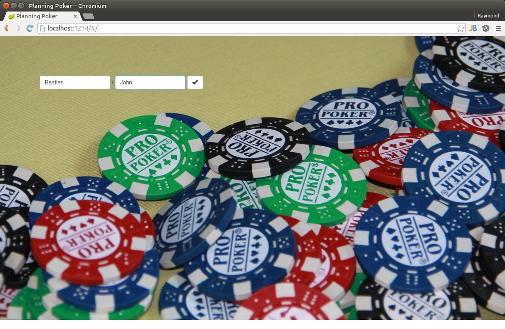
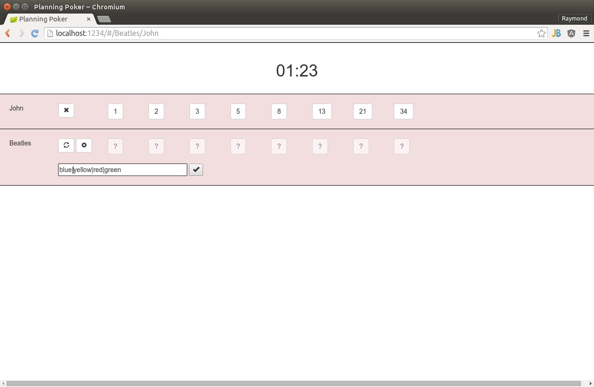
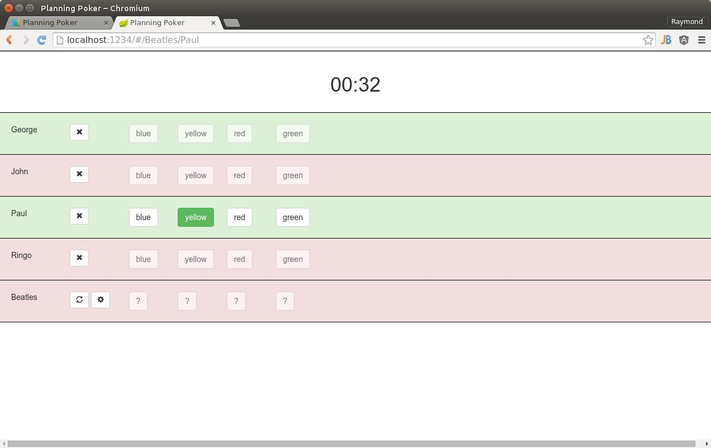
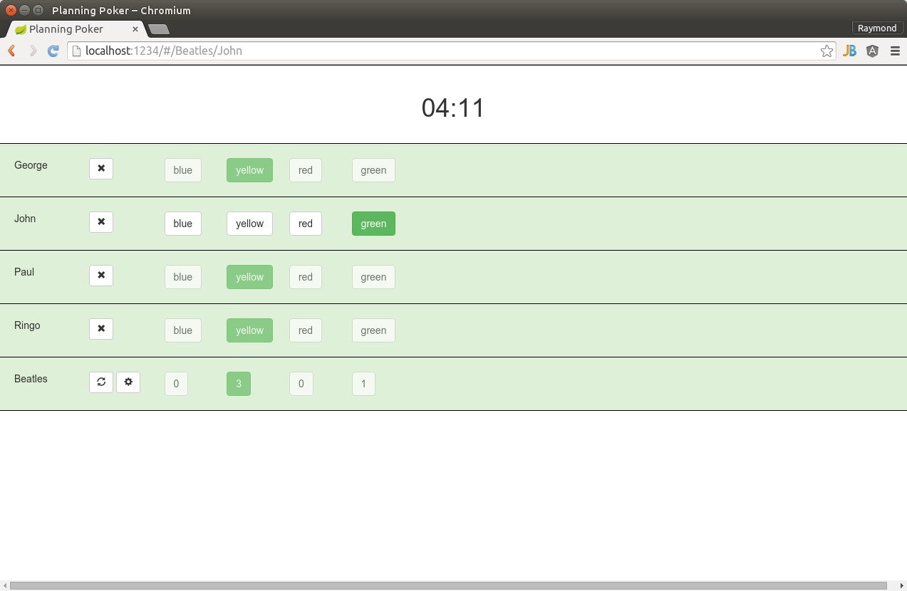

# Planning Poker
Websocket for live planning poker sessions
## Use case
The beatles want to choose the color of a submarine for the title of one of their songs.

John launches Planning Poker application, gives team name and his name:

John configures choices as the default does not suit him:

Paul, Ringo and Georges use their bookmark to launch the application. Paul's screen as he and George have voted:

The John screen when everyone voted:

## Build
gradle wrapper

bower install

./gradlew bootRun

or

./gradlew build && java -jar build/libs/planning-poker-0.1.0.jar [--server.port=1234]